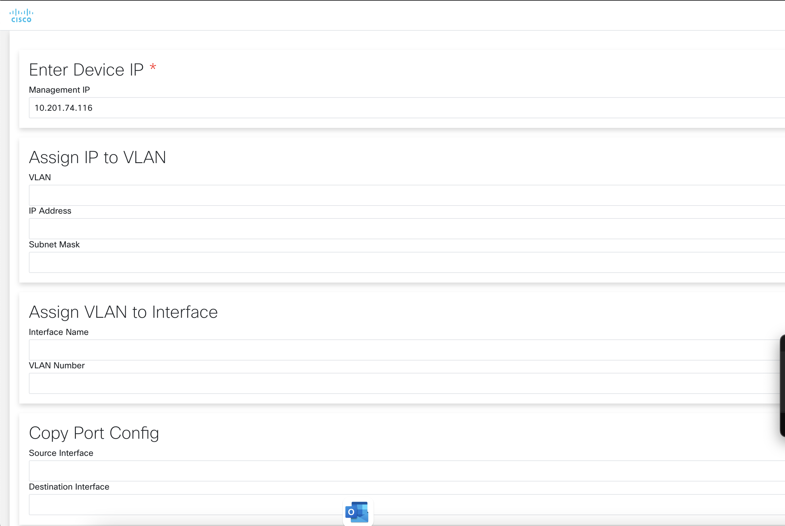

# GVE DevNet pyATS Greenbay Packaging Demo

## Contacts
* Charles Llewellyn (chllewel@cisco.com)

## Solution Components
* pyATS
* Catalyst 9k

## Configuration

### Testbed
In order to use pyATS, we have to create a testbed file, which contains the information on how to connect to the devices. The testbed file will include include the following elements:

* IP address
* Port
* Credentials
* Protocol (SSH, Telnet)
* Type of device

If you want to read more on how to create a testbed file, then consult the documentation in the following link: 

> https://pubhub.devnetcloud.com/media/pyats-getting-started/docs/quickstart/manageconnections.html#creating-testbed-yaml-file

## Installation

The following commands are executed in the terminal.

1. Clone this repository
     
       $ git clone [add_link_to_repository_here]
     
2. Access the cloned folder
       
       $ cd Greenbay_Packaging_Demo
        
3. Create and activate a virtual environment for the project:
   
        #WINDOWS:
        $ py -3 -m venv [add_name_of_virtual_environment_here] 
        $ source [add_name_of_virtual_environment_here]/Scripts/activate
        #MAC:
        $ python3 -m venv [add_name_of_virtual_environment_here] 
        $ source [add_name_of_virtual_environment_here]/bin/activate
        
> For more information about virtual environments, please click [here](https://docs.python.org/3/tutorial/venv.html)
        
4. Create a testbed file in the testbeds folder. 

5. Upgrade pip
        
        $ pip install --upgrade pip
        
6. Install the dependencies:

        $ pip install -r requirements.txt
        
7. Open the "networking.py" file and replace the following line with your testbed file in the 'testbeds' folder:
    
        $ testbed = "development.yaml"
        
## Usage
1. Use the following command to run the application:
       
       $ python app.py
       
       
2. A url will be displayed, open the URL in your web browser (tested on firefox) to access the application.

# Screenshots

### LICENSE

Provided under Cisco Sample Code License, for details see [LICENSE](LICENSE.md)

### CODE_OF_CONDUCT

Our code of conduct is available [here](CODE_OF_CONDUCT.md)

### CONTRIBUTING

See our contributing guidelines [here](CONTRIBUTING.md)

#### DISCLAIMER:
<b>Please note:</b> This script is meant for demo purposes only. All tools/ scripts in this repo are released for use "AS IS" without any warranties of any kind, including, but not limited to their installation, use, or performance. Any use of these scripts and tools is at your own risk. There is no guarantee that they have been through thorough testing in a comparable environment and we are not responsible for any damage or data loss incurred with their use.
You are responsible for reviewing and testing any scripts you run thoroughly before use in any non-testing environment.
